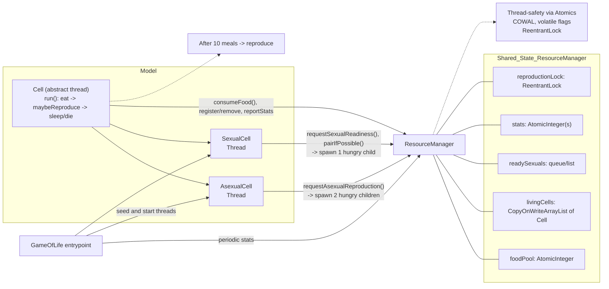

# 🧬 Cellular Life Simulation (Multithreaded Java)

This repository contains a **multithreaded simulation of cellular life**, demonstrating key Java concurrency concepts such as **threads, atomic variables, synchronization, and locking mechanisms**.  
The simulation models two types of cells — **Asexual** and **Sexual** — competing for a limited food resource in a shared environment.

---

## 🔬 Project Overview

The simulation represents a simple **ecosystem** where each cell runs as a **separate thread** with its own life cycle.  
Cells must **find food** to survive and **reproduce**, while the shared environment is managed by a central, thread-safe **ResourceManager**.

---

## 🧠 Key Concepts

1. **Concurrency**  
   Each `Cell` is a separate thread that executes independently, simulating real-time behavior.

2. **Resource Contention**  
   All cells compete for limited food units managed by `ResourceManager`.

3. **Synchronization**  
   The system uses:
   - `synchronized` blocks  
   - `Object.wait()` / `Object.notifyAll()`  
   - `AtomicInteger`  
   - `ReentrantLock`  
   to ensure proper coordination and prevent race conditions.

4. **Deadlock Prevention**  
   `SexualCell` instances implement **lock ordering** based on cell ID to coordinate mating safely.

5. **Thread Safety**  
   The `ResourceManager` provides a safe interface for all concurrent cell interactions with shared resources.

---

## ⚙️ How to Run the Simulation

### 1. Clone the Repository
```bash
git clone https://github.com/sxergiu/game-of-threads.git
cd [Your Repo Name]
```

### 2. Compile the Java Files
javac com/threads/sim/GameOfLife.java

### 3. Run the Main Class
java com.threads.sim.GameOfLife

## Architecture Diagram


